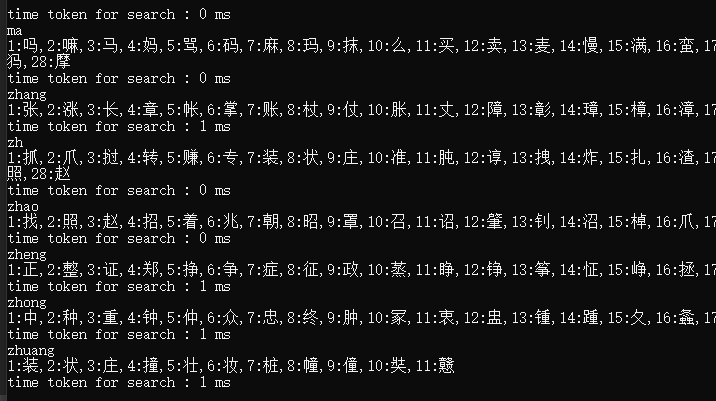
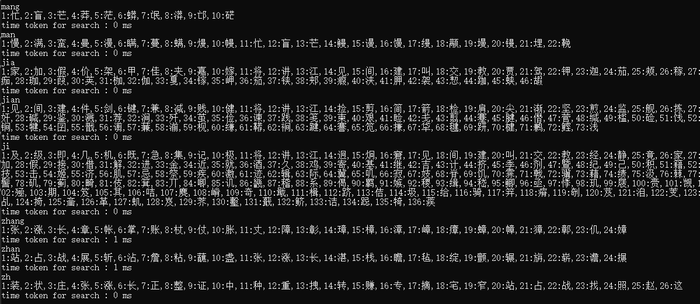

## 中文拼音输入法

基于C语言的，面向 stm32, esp32, AUDINO 等等嵌入式平台的，轻量级, 容易移植的中文拼音输入法。

目前支持拼音准确搜索和模糊匹配等功能， 之后会增加词库搜索支持

### 如何移植到你的嵌入式平台

- 此输入法全部需要的文件都在文件夹 zh_pinyin_decoder 下, 只需包含 zh_pinyin_decoder 即可, 目前测试平台为 windows, 只需稍加修改文件读取函数即可

> TODO : 之后会增加 stm32 平台的移植示例

### 版本更新日志

**V1.0 (2024.8.23):** 初次发布， 

**V1.1(2024.8.23)** : 修复 输入子串以 0 开头时的出错问题 

<b><mark style="background: transparent; color: red">V1.2(2024.8.25)</mark></b> (当前版本): <b><mark style="background: transparent; color: red">添加了一种类似哈希表的新型拼音搜索算法作为可选的搜索算法, 该种算法可以在增加 2kb 左右ROM 的代价下, 提高搜索速度效率</mark></b>

- 如何使用哈希搜索算法: 只需要将 zh_pinyin_decoder.h  中的宏 `USE_ZH_HASH_BOOST` 设置为 1 即可 

以下为采用 ZH_HASH_BOOST 的性能比较 : 

- 不采用 ZH_HASH_BOOST 算法的性能如下 : 对于较多字符情况, 耗时可能往往较高

- 采用 ZH_HASH_BOOST 情况下, 对于较多的数据， 也能保持较好的搜索性能 

