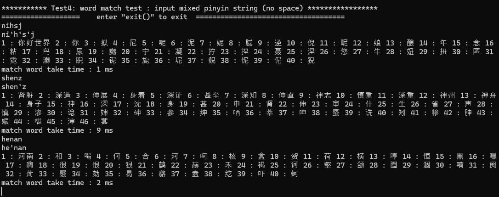

## 中文拼音输入法

=============== ⭐😀UPDATE TO NEW VERSION V1.5 😀⭐ ==================

基于C语言的，面向 stm32, esp32, ARDUINO 等等嵌入式平台的，以轻量级, 高支持性, 易用性， 易移植为目标编写和构建的中文拼音输入法。

在最新的版本1.5中，**添加了对 json 搜索词库的支持， 支持了分词和词库模糊搜索功能**, 只需将 `USE_ZH_WORD_MATCH` 设置为 1 即可，测试文件中的输入法示例同时支持多字词汇和单个汉字查找。

- 拼音码表(.bin文件)和词库(.json) 文件均可采用外置 Flash 进行存储, 码表文件仅越20kb, 词库文件仅约1MB, 在汉字输入方面支持几乎所有的 GB2312 汉字(约6000个常用汉字) , 同时外置 json 文件支持了超过 20000 词的词库搜索 (此词库具体词汇见项目 https://github.com/ling0322/webdict , 提取了其中词频超过2000的4字以下词汇作为 json 词库内容) 

- 可以通过选择宏 `USE_ZH_HASH_BOOST = 1` 支持一种更快的类似哈希算法， 提升约 50% 以上搜索速度。 同时词库是可选功能， 支持自定义裁剪。 

- 尤其适合配合 LVGL (默认UTF8编码)等图形库进行移植和使用， 保证对中文编码和输入法的支持。 

### 1min 教你运行你的第一个 demo

##### 对于 visual studio, 直接打开 GB2312search.vcxproj 并运行, 主程序为 GB2312search.cpp, 直接运行即可。

第一个测试 :  词库完整性测试, 正常测试结果如图所示 : 

第二个单个汉字模糊匹配测试,  示例测试如下 :

第三个为拼音分词测试， 示例测试和结果如下 : 

第四个为带词库的完整的输入法测试， 示例测试结果 : 

(其中 nhsj 由于n有精确匹配, 会舍弃 ni 的模糊匹配选项, 因此 nhsj 不会得到"你好世界"搜索结果) 

### 如何移植到你的嵌入式平台

- 此输入法全部源的文件都在文件夹 zh_pinyin_decoder 下, 只需包含 zh_pinyin_decoder.h 即可, 目前测试平台为 windows, 只需稍加修改文件读取函数即可, 如果需要词库支持, 则需要包含 cJSON 文件夹下的文件, 用于 json 词库解析。 
- 在使用 FATFS 文件系统的情况下, 只需要修改其中的文件读写函数就可以了 

> TODO : 之后会增加 stm32 平台的移植示例

### 在词库 json 文件中添加自定义词汇

此输入法虽然**不允许修改zh_pinyin.bin字库文件**, 但是词库是可以自定义进行添加词汇的。

>  说明 :  当前词库最高支持词汇中文长度是4,  因此不支持添加4字以上的词汇 

添加词汇需要查询词汇的Unicode码，首先找到 portable/softwares 中的中英字符编码查询， 查询到对应的字符 Unicode 编码

然后在 json 搜索到对应位置添加就行了(至少应当保证在首字母相同的一组中进行添加)

> 需要说明的是， 如果需要删除词库内容, 需要注意修改 zh_pinyin_decoder.c 中的 word_dict_offset 定义, 这个数组定义了每一个字母打头时，开始搜索的起始位置偏移(需要放到对应字母搜索的前一个拼音的位置, 在这之后至少保留一个 ], 符号

### 程序的时间和空间性能

如果不采用词库功能, 则约需要 2kb 的 ROM 存储对应的拼音码表索引，如果设置宏 USE_ZH_HASH_BOOST = 1 时, 则可以提高约一倍以上的搜索速度, 但也需要额外的 2kb 左右的相关表 ROM 内存。

对于单个汉字的拼音搜索匹配，x86 平台运行一般需要的时间都在 1ms 以内。

在采用词库的情况下, 可以通过 `ZH_WORD_DICT_BUFFER_SZ` 设置单次读取词库 json 文件的缓冲区大小, 而缓冲区设置的局部变量会占用相对较大的RAM空间, 默认设置为 4kb (建议使用词库情况下留出 2 * ZH_WORD_DICT_BUFFER_SZ 大小的RAM 空间), 此情况下 x86 平台绝大部分词语匹配在 5ms 以内, 一般不超过10ms

### 版本更新日志

**V1.0 (2024.8.23):** 初次发布， 

**V1.1(2024.8.23)** : 修复 输入子串以 0 开头时的出错问题 

<b><mark style="background: transparent; color: red">V1.2(2024.8.25)</mark></b> : <b><mark style="background: transparent; color: red">添加了一种类似哈希表的新型拼音搜索算法作为可选的搜索算法, 该种算法可以在增加 2kb 左右ROM 的代价下, 提高搜索速度效率</mark></b>

>  如何使用哈希搜索算法: 只需要将 zh_pinyin_decoder.h  中的宏 `USE_ZH_HASH_BOOST` 设置为 1 即可  

V1.3(2024.8.27) (当前版本) : 

1. **修改了码表(zh_pinyin_decoder.h)中**的字顺序:   `好号浩豪耗郝昊皓毫灏嚎蒿濠蚝壕颢镐嗥薅貉嚆` 为 `嚆貉薅嗥镐颢壕蚝濠蒿嚎灏毫皓昊郝耗豪号好` 使其更符合实际词频。

2. 修改了部分头文件中的宏定义, 如 `MAX_PINYIN_BUFFER_SZ` 改为  `MAX_CODE_BUFFER_SZ`, `MAX_PINYIN_SEARCH_TYPES` 改为 `MAX_CODE_SEARCH_TYPES` 等。 

3. 添加了主要文件中的函数声明和 license 声明部分 

4. **增加了拼音分词功能**, 添加了相应的拼音分词示例, 同时修复了测试程序中空格导致字符分不同串的问题。

5. 修复了在测试文件中的 res_str 变量在程序结束时, 栈附近溢出的问题 (Run-Time Check Failure #2 - Stack around the variable 'res_str' was corrupted.)

6. 修复提交中bin文件的 clrf 转换导致的位置问题， 目前已经可以正常直接下载压缩包进行测试和使用 

**V1.5(2024.9.1) (当前版本)**: 

1. 更新词库 json 文件, 进行重新排列。

2. 添加拼音分词结果过滤功能 

3. **增加了词库搜索功能, 目前已经支持超20000词库搜索模糊匹配功能， 能够实现体验感较好的带词库输入法以及词库模糊输入匹配**

4. 更新主程序声明部分， 添加了对于词库的测试  

5. 更改少部分zh_pinyin_decoder 中的宏定义
